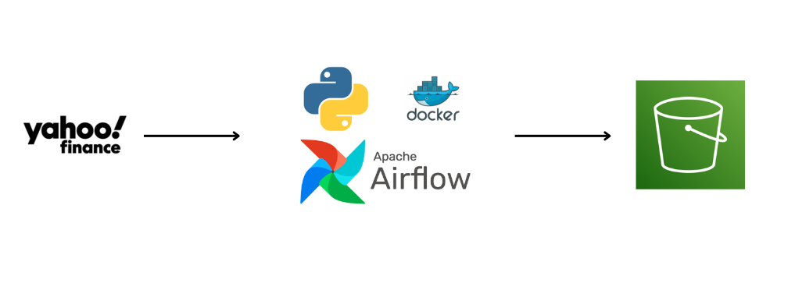
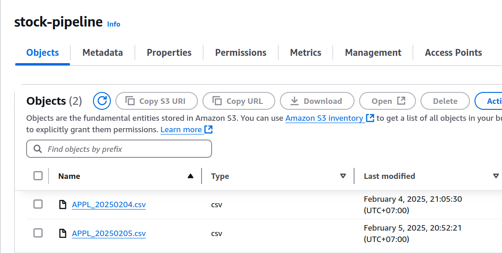

# stock-data-pipeline
# Stock Data Pipeline

This repository contains a stock data pipeline that fetches data from Yahoo Finance (`yfinance`), processes it using Apache Airflow in a Docker containerized environment, and pushes the results to AWS S3.

## Architecture

The pipeline follows this workflow:
1. Fetch stock market data using `yfinance`.
2. Process and clean the data within an Apache Airflow DAG.
3. Store the processed data in AWS S3.



## Setup and Installation

### Prerequisites
Ensure you have the following installed:
- Docker & Docker Compose
- AWS CLI configured with credentials
- Apache Airflow

### Steps to Run the Pipeline

1. Clone this repository:
   ```sh
   git clone git@github.com:vinhhoanglong/stock-data-pipeline.git
   cd stock-datapipeline

2. Start the Docker containers:
    ```sh
    docker compose up -d

## Result
you will get the result like this in s3 console

